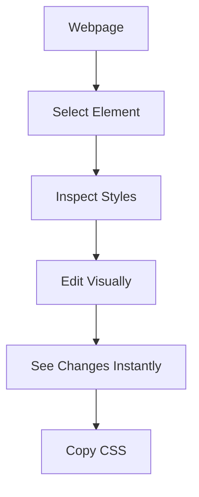
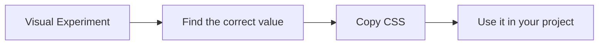
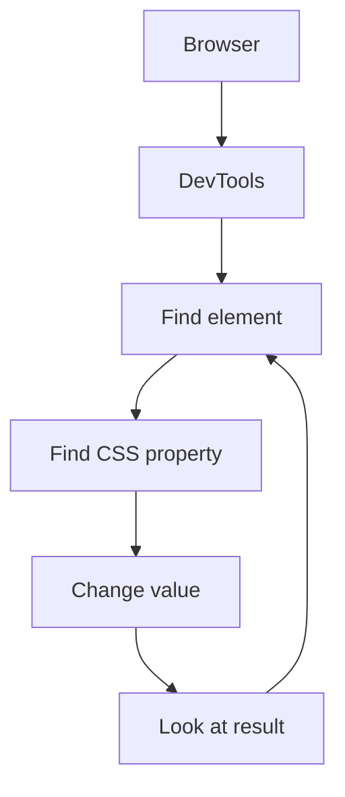
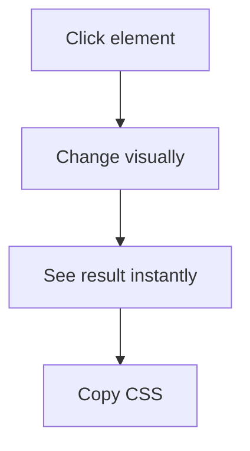
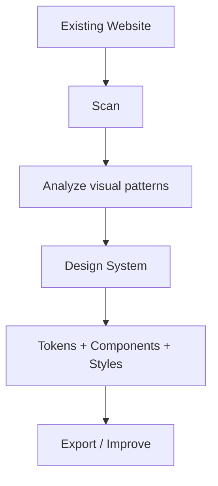

<div align="center">

# ✦ DevStyle

**Visual CSS editing for frontend developers.**

Select an element. Change the CSS. See the result instantly.


[View on GitHub](#) · [Report a Bug](#-contributing) · [Request a Feature](#-contributing)

</div>

---

> **Don't guess the CSS value. See it.**
> DevStyle is a Chrome extension that brings a visual CSS editing workflow directly onto any webpage. Select an element, inspect its layout, modify styles in real time, move or resize it visually, and copy the resulting CSS.

<!-- Add a real screenshot or GIF here once available — this is the single highest-impact addition for a README like this. -->
<!--  -->

## 📚 Table of Contents

- [What is DevStyle?](#-what-is-devstyle)
- [Features](#-current-features)
- [Feature Details](#-feature-details)
- [Keyboard Shortcuts](#️-keyboard-shortcuts)
- [Why DevStyle?](#-why-devstyle)
- [Design Philosophy](#-design-philosophy)
- [Roadmap](#️-roadmap)
- [Project Structure](#️-project-structure)
- [Installation](#-installation)
- [Contributing](#-contributing)
- [Support the Project](#-support-the-project)

---

## 🎬 What is DevStyle?

Frontend developers constantly switch between a webpage, DevTools, and a code editor just to answer one simple question: *"What CSS value should I change?"*

DevStyle makes that process visual.



---

## ✨ Current Features

| Feature | Status | What it does |
|---|:---:|---|
| 🎯 Visual Inspector | ✅ | Select and inspect webpage elements |
| 📐 Layout Editor | ✅ | Edit dimensions and positioning |
| 🔤 Typography | ✅ | Edit text-related CSS |
| 🎨 Appearance | ✅ | Edit background and opacity |
| 🧱 Border Editor | ✅ | Edit borders and radius |
| 📦 Spacing Editor | ✅ | Edit margin, padding, and gap |
| ▣ Visual Box Model | ✅ | Visually edit margin, border, and padding |
| 🖱️ Move Element | ✅ | Drag elements directly on the page |
| ↔️ Resize Element | ✅ | Resize selected elements visually |
| 🧩 Flexbox Inspector | ✅ | Inspect and edit Flexbox layouts |
| ▦ Grid Inspector | ✅ | Inspect and edit CSS Grid layouts |
| 🌐 Universal Layout Inspector | 🚧 | Visual hierarchy for component structure |
| 🔍 CSS Property Search | ✅ | Quickly find CSS properties |
| 📋 Copy CSS | ✅ | Copy your changes as CSS |
| ⌨️ Keyboard Shortcuts | ✅ | Fast keyboard-driven workflow |
| 🎨 Design System Generator | 🔜 | Analyze and generate website design systems |

**Legend:** ✅ Available · 🚧 In development · 🔜 Planned

---

## 🔎 Feature Details

<details>
<summary><strong>🎯 Visual Element Inspector</strong></summary>
<br>

Select elements directly from the webpage instead of manually searching through the DOM.

- Hover to highlight elements
- Click to select an element
- Inspect the selected element (tag, ID, class)
- Select body and root-level elements
- Switch to another element quickly

</details>

<details>
<summary><strong>📐 Layout Editor</strong></summary>
<br>

Change the most common layout properties without leaving the webpage.

| Supported properties | Position modes |
|---|---|
| Width, Height | Static |
| Top, Right, Bottom, Left | Relative |
| Z-index | Absolute, Fixed, Sticky |

Changes are applied to the selected element immediately.

</details>

<details>
<summary><strong>🔤 Typography</strong></summary>
<br>

Experiment with typography visually:

- Font Family
- Font Size
- Font Weight
- Font Color
- Line Height
- Letter Spacing
- Text Alignment

This makes it easy to find the right visual value before copying it into your project.

</details>

<details>
<summary><strong>🎨 Appearance</strong></summary>
<br>

Currently supports:

- Background color
- Opacity

</details>

<details>
<summary><strong>🧱 Border</strong></summary>
<br>

Edit border styling in real time.

**Controls:** Border Width · Border Radius · Border Color · Border Style
**Styles:** None · Solid · Dashed · Dotted · Double

</details>

<details>
<summary><strong>📦 Spacing & Visual Box Model</strong></summary>
<br>

Control the spacing around and inside an element — Margin, Padding, Gap — with a live visual box model:

```
┌─────────────────────────────┐
│           MARGIN            │
│  ┌───────────────────────┐  │
│  │        BORDER          │  │
│  │  ┌─────────────────┐  │  │
│  │  │     PADDING      │  │  │
│  │  │  ┌───────────┐   │  │  │
│  │  │  │  CONTENT  │   │  │  │
│  │  │  └───────────┘   │  │  │
│  │  └─────────────────┘  │  │
│  └───────────────────────┘  │
└─────────────────────────────┘
```

Each layer (Margin, Border, Padding) exposes Top / Right / Bottom / Left controls. Also displays content width, content height, and box-sizing.

</details>

<details>
<summary><strong>🖱️ Move Elements Visually</strong></summary>
<br>

Select an element, activate **Move Element**, and drag it directly on the webpage.

Dragging translates into real CSS, for example:

```css
position: relative;
left: 50px;
top: 20px;
```

Useful when you know *where* an element should move but not the exact value.

</details>

<details>
<summary><strong>↔️ Resize Elements Visually</strong></summary>
<br>

Resize selected elements directly on the webpage using visual resize handles, instead of repeatedly editing:

```css
width: ...;
height: ...;
```

</details>

<details>
<summary><strong>🧩 Flexbox Inspector</strong></summary>
<br>

When the selected element is a Flexbox container, DevStyle exposes a dedicated Flexbox section for:

- Flex Direction
- Justify Content
- Align Items
- Flex Wrap
- Gap

</details>

<details>
<summary><strong>▦ Grid Inspector</strong></summary>
<br>

When the selected element uses CSS Grid, DevStyle provides controls for:

- Grid Template Columns / Rows
- Grid Gap, Column Gap, Row Gap
- Alignment

</details>

<details>
<summary><strong>🌐 Universal Layout Inspector (in development)</strong></summary>
<br>

Understands a selected component as a complete visual structure rather than one CSS property at a time.

```
.page
├── header
│   └── nav
│       ├── a
│       └── a
└── main
    └── section
        └── article
```

Target coverage: Flexbox, CSS Grid, block/inline layout, absolute/fixed/sticky positioning, normal flow, and mixed layouts.

</details>

<details>
<summary><strong>🔍 CSS Property Search & 📋 Copy CSS</strong></summary>
<br>

Search directly for a property (`padding`, `font-size`, `border-radius`, `display`, `width`, ...) instead of opening every category manually.



</details>

---

## ⌨️ Keyboard Shortcuts

| Shortcut (Win/Linux) | Shortcut (macOS) | Action |
|---|---|---|
| `Ctrl + Shift + E` | `Cmd + Shift + E` | Start DevStyle inspector |
| `H` | `H` | Select another element |
| `M` | `M` | Move selected element |
| `Esc` | `Esc` | Cancel the active mode |

Shortcuts are designed to keep the workflow inside the webpage rather than forcing repeated mouse interaction with the extension panel.

---

## ⚡ Why DevStyle?

<table>
<tr>
<th>Traditional workflow</th>
<th>DevStyle workflow</th>
</tr>
<tr>
<td>



</td>
<td>



</td>
</tr>
</table>

The focus is visual iteration — fewer round trips, faster answers.

---

## 🧠 Design Philosophy

| # | Principle | Description |
|---|---|---|
| 01 | **Visual first** | If a CSS value can be understood visually, make it visual. |
| 02 | **Instant feedback** | Changes should appear immediately. |
| 03 | **Less guessing** | Developers should experiment with values instead of predicting them. |
| 04 | **Keep the developer in flow** | Fewer tool switches, faster iteration. |
| 05 | **CSS remains the source** | DevStyle helps you discover values; the resulting CSS is copied into the real project. |

---

## 🛣️ Roadmap

The next major phase moves beyond individual element editing toward understanding an entire website's visual language.

### 🎨 Design System Generator — *Planned*

Scan a website and turn its existing visual patterns into a readable design-system dashboard.



**Planned analysis:** Colors · Typography · Spacing · Radius · Shadows · Components · Icons · Design Tokens

**Planned capabilities:**
- [ ] Website design-system overview
- [ ] Color palette extraction + usage counts
- [ ] Font-family detection & font-size scale
- [ ] Spacing and border-radius scale
- [ ] Shadow analysis
- [ ] Component detection (buttons, inputs, cards)
- [ ] Icon analysis
- [ ] CSS variable / design-token detection & visualization
- [ ] Exportable design-system CSS
- [ ] Highlight token/color usage on the page
- [ ] Edit common design values

### 🧩 Bootstrap Support — *Planned*

- [ ] Detect Bootstrap components and utility classes
- [ ] Understand Bootstrap spacing utilities
- [ ] Inspect Bootstrap typography utilities and grid structure
- [ ] Understand Bootstrap breakpoints
- [ ] Suggest Bootstrap-compatible changes

### 🚀 Other Future Improvements

- [ ] Better responsive layout inspection
- [ ] More CSS properties + CSS variable editing
- [ ] Advanced layout debugging
- [ ] Improved component hierarchy visualization
- [ ] Design-token editing
- [ ] More framework support
- [ ] Improved export tools
- [ ] Performance improvements on large webpages

> Features marked *Planned* are concepts for future releases and are **not available** in the current version.

---

## 🏗️ Project Structure

DevStyle is a **Manifest V3** Chrome extension.

```
DevStyle/
├── manifest.json      # Chrome extension configuration
├── background.js      # Extension background / service worker
├── content.js          # Inspector, editor and webpage interaction
├── content.css         # DevStyle interface styling
├── popup.html          # Extension popup structure
├── popup.css           # Popup styling
├── popup.js             # Popup interactions
└── icons/
    ├── icon16.png
    ├── icon32.png
    ├── icon48.png
    └── icon128.png
```

---

## 📥 Installation

DevStyle is not yet published on the Chrome Web Store. Load it manually in developer mode:

1. Clone or download this repository.
   ```bash
   git clone https://github.com/<your-username>/DevStyle.git
   ```
2. Open Chrome and go to `chrome://extensions`.
3. Toggle on **Developer mode** (top-right corner).
4. Click **Load unpacked** and select the `DevStyle/` folder.
5. Pin the DevStyle icon to your toolbar and press `Ctrl+Shift+E` (`Cmd+Shift+E` on macOS) on any page to start.

---

## 🤝 Contributing

Ideas, feedback, bug reports, and contributions are welcome.

1. **Open an issue** — describe the problem or idea.
2. **Include repro steps** for bugs when possible.
3. **Suggest improvements** you'd like to see.
4. **Submit a pull request** if you want to contribute code.

---

## ⭐ Support the Project

If DevStyle is useful to you:

- ⭐ Star the repository
- 🐛 Report bugs
- 💡 Suggest features
- 🔧 Contribute code
- 📣 Share it with other frontend developers

---

<div align="center">

**DevStyle — See the CSS. Change the CSS.**

Built for developers who think visually.

Developed by **Yazz**

</div>
